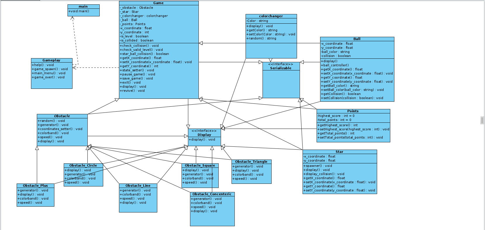

# ColorSwitch
Design Patterns

    Facade - We have assigned different functionalities to different entities 
    Template - Template design pattern is used in the Main menu
    Composite - Each game holds its own objects
    State -  Used in revivals, starting new games, game saving, collisions and scrolling in the game object in current state
    Decorator - Used in the output streams used for serializing the data 
    Observer - Event handlers and listeners act as the observers
    Flyweight - Used internally by the String class

Implementation
    
    We have used Timeline (a feature of the javafx library) as the basis for all the core functionality of the game such as the moving the ball, creating and spawning the various entities in the game
    We have used serialize and deserialize to implement the save and load functionality respectively to store the game state in text files
    For checking collision we have used localbound and intersection functions
    We have implemented the in-game transitions such as explosion and revival transitions by combining different javafx transitions.

Bonus

    We have made a new game mode called space switch
    This game mode has a similar design aesthetic to color switch but provides a different gaming experience
    We have made a saved games table that maintains date and time, takes input from user to be used as ID
    We have also maintained a global high score across multiple games 
    We have also added sound effects and background music as another output
    We have created new animations to be used such as collision and revival

    
